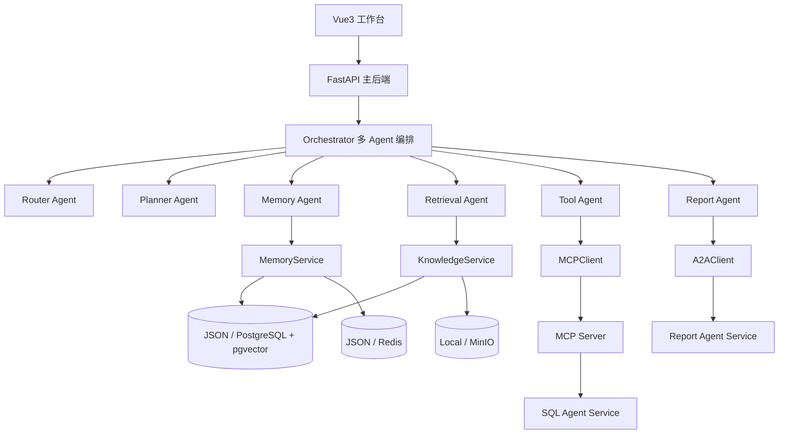
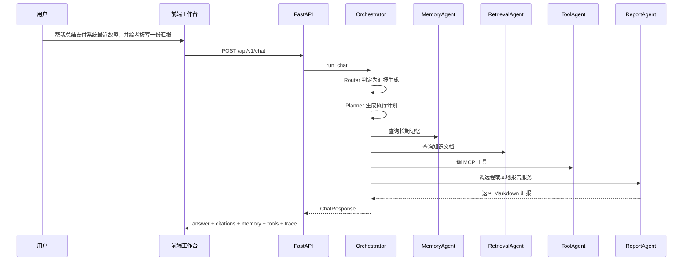

# 架构说明

## 1. 总体架构图

## 2. 一次汇报任务的执行时序

## 3. 模块边界

### 3.1 主后端

负责：

- 对外 API
- Agent 编排
- RAG 和 Memory 主流程
- 工具聚合与结果整合

### 3.2 独立服务

负责：

- MCP Server：统一工具接入协议
- SQL Agent：只读 SQL 分析
- Report Agent：独立报告生成能力

### 3.3 存储与基础设施

负责：

- PostgreSQL + pgvector：结构化数据与向量检索
- Redis：短期会话
- MinIO：原始文件对象存储

## 4. 设计取舍

- 为保证项目可运行，默认保留 JSON / 本地文件回退模式
- 为保证基础设施完整性，同时实现 PostgreSQL、Redis、MinIO 真实接入
- 为保证协议接入真实可信，MCP Server 使用官方 SDK，而不是伪造“像 MCP”的 JSON 接口
- 为保证演示效果，前端把引用、Memory、工具结果、Trace 与指标拆成明确功能区
