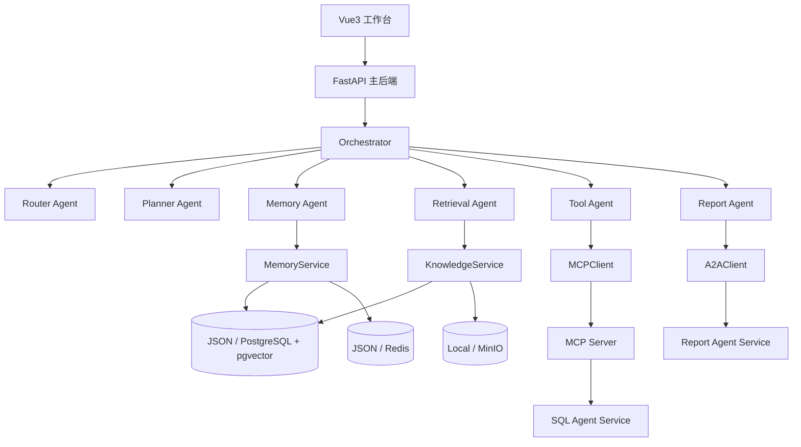
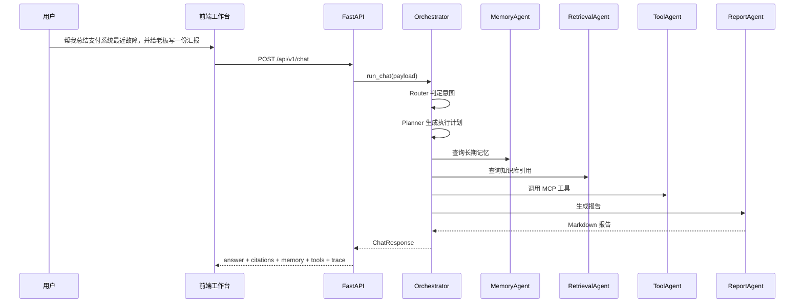

# 学习文档

这份文档的目标不是简单介绍项目，而是帮助你系统学习这套代码仓库的架构设计、技术栈、执行链路和工程实现方式。

项目根目录：`D:\dev\vscode\ai_project\learn_agent`

配套阅读建议：

- 如果你想先建立整体概念，先看这份文档
- 如果你想跟着文件逐个走读，再看 [源码导读文档](source-walkthrough.md)

---

## 第 1 章：先明确“这个项目现在真实是什么”

这是一个围绕“故障复盘与汇报”主场景构建的多 Agent 企业知识助理系统。它不是一个泛化聊天机器人，也不是一个已经接入真实大模型的 Copilot 平台，而是一套可以真实运行、可以完整演示核心架构思想的工程化项目。

当前仓库里已经真实实现的能力包括：

- FastAPI 主后端
- Vue3 工作台前端
- Router / Planner / Retrieval / Memory / Tool / Report 多 Agent 编排
- 文档上传、解析、切块、检索与引用返回
- 长期记忆写入与检索
- MCP Server 工具接入
- A2A 风格远程报告协作
- PostgreSQL + pgvector / Redis / MinIO 的可切换基础设施模式
- 本地 JSON / 本地文件回退模式
- ECharts 指标展示与 Agent Trace 展示
- OCR 回退解析扫描 PDF / 图片

当前仓库里没有接入、或者没有做成“真实在线智能推理服务”的能力也要明确说明：

- 没有接真实 LLM API
- 没有接真实 Embedding API
- 意图分类、SQL 规划、报告生成目前是规则/模板驱动，而不是大模型生成
- 没有做用户认证、权限系统、多租户隔离
- 没有做复杂 rerank 模型

这点很重要，因为学习项目时，必须区分：

- 已实现的真实能力
- 可以继续扩展的方向

---

## 第 2 章：学习这份项目，你应该掌握什么

如果你顺着这份文档把项目走完，建议至少掌握以下内容：

1. 这个项目如何把“故障复盘”场景拆成多个明确模块。
2. 为什么 RAG 和 Memory 必须拆开实现，而不是混成一个知识库。
3. MCP 和 A2A 在代码里分别解决了什么问题。
4. 为什么要有 JSON 回退模式和 PostgreSQL / Redis / MinIO 真实模式并存。
5. 一次请求如何穿过 `API -> Orchestrator -> Agents -> Services -> Repositories`。
6. 前端如何把复杂的执行结果拆成可解释的多个区域展示。
7. 如何把一套“可面试的项目”做成一套真正能运行的工程骨架。

---

## 第 3 章：项目要解决什么问题

这个项目聚焦的核心问题不是“用户能不能问答”，而是：

- 企业内部知识分散，事故复盘文档不容易找到
- 用户经常需要反复说明“我负责哪个系统、喜欢什么输出格式”
- 工具调用散落在各处，缺少统一协议接入
- 复杂任务不适合由一个 Agent 硬做到底
- 前端如果只是聊天框，结果很难解释和展示

所以这个项目想做的是：

- 帮工程师查复盘文档和知识库
- 帮系统记住稳定的用户背景和偏好
- 帮系统统一调用工具能力
- 帮多个 Agent 协作生成分析结果或老板汇报
- 帮前端把“答案依据”清楚展示出来

---

## 第 4 章：主场景到底是什么

主场景只有一个：故障复盘与汇报。

一个典型请求是：

> 帮我总结支付系统最近故障，并给老板写一份汇报

这个请求在项目中会被拆成：

- 先判断它是“汇报生成”任务
- 再查用户背景记忆，例如“我负责支付系统”
- 再查知识库里的事故复盘、Runbook、风险周报
- 再查工具结果，例如工单、指标、SQL 分析
- 最后把这些依据组织成 Markdown 汇报

也就是说，这个项目的重点不是“回答一句话”，而是“组织一条完整的故障复盘工作链”。

---

## 第 5 章：总体架构图

### 5.1 逻辑架构图



### 5.2 一次请求的时序图



### 5.3 为什么这套架构适合学习

因为它把不同问题拆成了不同层：

- 前端层：负责展示和交互
- API 层：负责接口入口
- Agent 层：负责流程编排
- Service 层：负责能力实现
- Repository 层：负责数据存取
- 独立服务层：负责跨服务协作与工具协议

学习时你会更容易分清“哪一层解决哪类问题”。

---

## 第 6 章：技术栈总览

### 6.1 后端技术栈

根据 `backend/requirements.txt`，当前真实使用的后端依赖包括：

- `fastapi`：后端 Web 框架
- `uvicorn`：ASGI 服务运行器
- `pydantic` / `pydantic-settings`：模型校验与配置管理
- `sqlalchemy`：ORM 和数据库访问
- `psycopg`：PostgreSQL 驱动
- `pgvector`：向量列与相似度检索
- `redis`：短期会话缓存
- `minio`：对象存储客户端
- `mcp`：MCP 协议 SDK
- `httpx`：异步 HTTP 客户端
- `pypdf`：PDF 文本抽取
- `python-docx`：DOCX 文本抽取
- `PyMuPDF`：PDF 转图片，配合 OCR 回退
- `rapidocr-onnxruntime`：OCR 能力
- `Pillow`：图片处理
- `langgraph`：可选图编排运行时

### 6.2 前端技术栈

根据 `frontend/package.json`，当前真实使用的前端依赖包括：

- `vue`：前端框架
- `pinia`：状态管理
- `axios`：HTTP 客户端
- `marked`：Markdown 渲染
- `echarts`：图表展示
- `element-plus`：UI 组件库
- `vite`：构建工具
- `typescript`：类型系统

### 6.3 基础设施技术栈

项目支持两种运行模式：

- 轻量本地模式：`JSON + 本地文件`
- 基础设施模式：`PostgreSQL + pgvector + Redis + MinIO`

### 6.4 协议与服务边界

- `MCP`：统一工具接入协议
- `A2A 风格 HTTP`：主后端与独立报告服务协作

---

## 第 7 章：目录结构应该怎么读

```text
learn_agent/
├─ backend/
│  ├─ app/
│  │  ├─ api/            # HTTP 路由
│  │  ├─ agents/         # 多 Agent 编排节点
│  │  ├─ core/           # 配置、启动、容器装配
│  │  ├─ models/         # Pydantic 模型
│  │  ├─ repositories/   # JSON / PostgreSQL / Redis 存储
│  │  └─ services/       # 业务能力
│  ├─ data/              # JSON 回退模式数据
│  └─ requirements.txt
├─ frontend/
│  ├─ src/
│  │  ├─ components/     # 图表组件
│  │  ├─ stores/         # Pinia 状态管理
│  │  ├─ App.vue         # 工作台主页面
│  │  ├─ api.ts          # axios 封装
│  │  ├─ types.ts        # TS 类型定义
│  │  └─ styles.css      # 全局样式
│  └─ package.json
├─ services/
│  ├─ mcp_server/        # MCP 工具服务
│  ├─ sql_agent_service/ # SQL 分析服务
│  └─ report_agent_service/
├─ docs/
└─ docker-compose.yml
```

阅读建议：

- 先读 `backend`
- 再读 `services`
- 最后读 `frontend`

原因是前端展示的所有内容都来自后端编排结果，先懂后端更容易理解前端在展示什么。

---

## 第 8 章：后端启动过程

### 8.1 入口文件：`backend/app/main.py`

这个文件的作用很单纯：

- 创建 FastAPI 实例
- 配置 CORS
- 启动时调用 `bootstrap_app_state()`
- 注册 `/health` 和所有业务路由

关键点不是代码长短，而是职责是否清晰。

`main.py` 本身不做复杂业务，因为：

- 启动逻辑应当集中在 `core`
- 业务逻辑应当集中在 `services` 和 `agents`

### 8.2 启动钩子：`backend/app/core/bootstrap.py`

这个文件做两件事：

1. 创建本地目录
2. 把 `build_container()` 的结果挂到 `app.state.container`

这么设计以后，整个后端的依赖注入就有了统一入口。

### 8.3 容器装配：`backend/app/core/container.py`

这是最值得认真读的文件之一。

它把一整套运行时依赖串起来：

1. 决定主存储后端
2. 决定短期会话后端
3. 决定对象存储后端
4. 创建基础组件：`EmbeddingService`、`DocumentParser`
5. 创建服务：`KnowledgeService`、`MemoryService`、`OpsService`
6. 创建协议客户端：`MCPClient`、`A2AClient`
7. 创建 Agent：`ToolAgent`、`ReportAgent`
8. 创建 `Orchestrator`

这里体现的是“自底向上装配”的思路：

- 基础设施先准备好
- 业务能力建立在基础设施之上
- 编排建立在业务能力之上

---

## 第 9 章：数据模型层学什么

文件：`backend/app/models/schemas.py`

这个文件主要有三类模型：

### 9.1 请求/响应模型

例如：

- `ChatRequest`
- `ChatResponse`
- `DocumentUploadResponse`
- `MemoryCreateRequest`
- `OverviewResponse`

这些模型解决的是“接口怎么对外说话”。

### 9.2 领域模型

例如：

- `Citation`
- `MemoryRecord`
- `MemoryHit`
- `DocumentRecord`
- `DocumentChunk`
- `TraceStep`

这些模型解决的是“系统内部怎么表达数据”。

### 9.3 指标模型

例如：

- `RunMetrics`
- `OverviewCard`
- `OverviewMetric`

这些模型解决的是“结果如何被解释和展示”。

这也是项目可解释性的一部分：

- 不只是返回一段回答
- 还把依据和运行指标包装成稳定结构

---

## 第 10 章：Repository 层怎么理解

Repository 层解决的是：

- 上层业务不应该直接碰数据库细节
- 上层业务不应该知道当前到底是 JSON 模式还是 PostgreSQL 模式

### 10.1 `JsonStore`

文件：`backend/app/repositories/json_store.py`

作用：

- 本地轻量运行
- 没有数据库也能完整跑通主链路
- 方便学习时看原始数据文件

它维护了这些 JSON 文件：

- `documents.json`
- `chunks.json`
- `memories.json`
- `conversations.json`
- `runs.json`

### 10.2 `PostgresStore`

文件：`backend/app/repositories/postgres_store.py`

作用：

- 提供真实的结构化数据存储
- 提供 pgvector 向量检索
- 支撑工单、故障事件、运行指标等更接近真实系统的数据面

它的 ORM 模型包括：

- `DocumentModel`
- `ChunkModel`
- `MemoryModel`
- `RunModel`
- `TicketModel`
- `IncidentEventModel`

为什么还要有 `tickets` 和 `incident_events`？

因为如果没有业务数据面，MCP 和 SQL Agent 就会变成空壳演示。

### 10.3 `RedisConversationStore`

文件：`backend/app/repositories/redis_store.py`

作用：

- 只负责短期会话消息
- 支持 TTL
- 适合高频、短期、可过期数据

这里体现了数据分工：

- 长期数据进数据库
- 短期上下文进 Redis

---

## 第 11 章：Service 层是项目的业务核心

Service 层回答的是：系统会什么。

### 11.1 `EmbeddingService`

文件：`backend/app/services/embedding_service.py`

它不是接远程 Embedding API，而是用了一个轻量的“哈希向量”实现。

你要明确这件事：

- 这不是生产级语义向量模型
- 但它足够支撑教学、演示和本地 RAG 流程验证

核心思路：

1. 对文本做轻量 token 化
2. 把 token 映射到固定维度桶里
3. 统计频次并归一化
4. 用余弦相似度比较向量

代码片段：

```python
for token, count in counts.items():
    vector[hash(token) % self.dimensions] += count / total
return self._normalize(vector)
```

学习重点：

- 它如何让“向量检索链路”在没有真实模型时仍然存在

### 11.2 `DocumentParser`

文件：`backend/app/services/document_parser.py`

这个模块负责统一不同文件类型的文本提取。

当前支持：

- `pdf`
- `docx`
- `png/jpg/jpeg/bmp`
- 直接文本内容

处理策略是：

- PDF 优先直接抽文本
- 抽不到时，若开启 OCR，则转图做 OCR
- DOCX 提取段落和表格
- 图片直接 OCR

这体现了一个很实用的工程思路：

- 尽量先走低成本、确定性更高的解析方式
- 不行再走 OCR 回退

### 11.3 `KnowledgeService`

文件：`backend/app/services/knowledge_service.py`

这是 RAG 的核心服务。

它做两件事：

1. 摄取文档
2. 检索文档

#### 摄取流程

`ingest_document()` 的链路：

1. 调 `DocumentParser.parse()` 获取纯文本
2. 如果有原始文件，写入对象存储
3. 创建 `DocumentRecord`
4. 对文本做轻量切块
5. 对每个切块生成 embedding
6. 把切块写入存储

代码片段：

```python
for index, chunk in enumerate(self._chunk_text(cleaned_text)):
    chunk_payloads.append(
        {
            'id': self._new_id('chunk'),
            'document_id': document_id,
            'chunk_index': index,
            'content': chunk,
            'metadata': {
                'source': source,
                'title': title,
                'embedding': self.embedding_service.embed_text(chunk),
            },
        }
    )
```

#### 检索流程

`search()` 的链路：

1. 问题转 embedding
2. 如果底层支持 `search_chunks()`，就走 pgvector
3. 否则走 JSON 本地相似度检索
4. 把结果包装成 `Citation`

这个设计的亮点是：

- 上层不需要知道底层到底是 JSON 还是 PostgreSQL

### 11.4 `MemoryService`

文件：`backend/app/services/memory_service.py`

这是另一个核心服务。

它负责：

- 长期记忆创建
- 长期记忆查询
- 会话消息记录
- 运行指标记录
- 根据关键词判断是否应该写入长期记忆

最值得关注的是：`maybe_capture_memory()`。

它体现的产品思路是：

- 不是所有用户输入都应该长期记住
- 只有稳定、有复用价值的信息才值得写入长期记忆

当前关键词策略包括：

- `记住`
- `偏好`
- `喜欢`
- `负责`
- `以后默认`
- `长期`

### 11.5 `OpsService`

文件：`backend/app/services/ops_service.py`

这个模块很容易被忽略，但它非常关键，因为它提供了项目的“业务数据面”。

它负责：

- 指标查询
- 工单查询
- SQL 规划
- SQL 执行
- SQL 查询结果摘要

学习重点：

- 它不是 LLM 工具，而是明确的领域服务
- SQL 规划是规则驱动，不伪装成大模型 NL2SQL

### 11.6 `MCPClient`

文件：`backend/app/services/mcp_client.py`

它解决的问题是：

- 主系统如何统一调工具

它的策略非常值得学习：

- 有远程 `MCP Server` 就走标准协议
- 没有远程就回退到本地服务

这就是“远程优先，本地兜底”的工程设计。

### 11.7 `A2AClient`

文件：`backend/app/services/a2a_client.py`

它解决的问题是：

- 报告生成能力如何独立部署出去

逻辑是：

- 有远程报告服务就发 HTTP 请求
- 没有就用本地 Markdown 模板生成

所以这里的 A2A 不是抽象概念，而是一个真实可运行的服务边界。

### 11.8 `DashboardService`

文件：`backend/app/services/dashboard_service.py`

它负责前端首页概览：

- 主场景卡片
- 编排引擎卡片
- 存储后端卡片
- 文档数量、记忆数量、运行次数
- RAG 命中率、平均 Agent 调用、平均耗时

这个模块的意义在于：

- 不让前端自己拼统计逻辑
- 把概览指标集中收敛在后端

---

## 第 12 章：Agent 层怎么学习

Agent 层回答的是：系统如何协作完成任务。

### 12.1 `RouterAgent`

职责：把用户请求归类成 4 类意图。

当前分类：

- `knowledge_query`
- `status_analysis`
- `report_generation`
- `preference_management`

### 12.2 `PlannerAgent`

职责：根据意图决定要走哪些节点。

示例：

- 知识查询：`memory -> retrieval`
- 状态分析：`memory -> retrieval -> tool`
- 汇报生成：`memory -> retrieval -> tool -> report`

### 12.3 `MemoryAgent`

职责：查长期记忆。

### 12.4 `RetrievalAgent`

职责：查知识库。

### 12.5 `ToolAgent`

职责：统一调工具。

当前固定并发调用的工具有：

- `search_docs`
- `search_memory`
- `query_metric('incident_count')`
- `query_metric('alpha_risk_score')`
- `get_ticket('INC-1024')`
- `run_sql_analysis(message)`

### 12.6 `ReportAgent`

职责：调 `A2AClient` 生成汇报。

### 12.7 `Orchestrator`

文件：`backend/app/agents/orchestrator.py`

这是整个项目最核心的文件。

你要重点理解：

1. 为什么它不直接把所有逻辑写在 `run_chat()` 里
2. 为什么它仍然保留 `_route_node / _plan_node / _memory_node ...` 这样的节点函数
3. 为什么它既支持 `LangGraph`，也支持内置顺序编排

这是一个很典型的“面向演进”的设计：

- 内置顺序编排保证最小可运行
- LangGraph 让项目具备更强的可扩展性和可讲述性

代码片段：

```python
if self.graph_app is not None:
    final_state = await self.graph_app.ainvoke(state)
    orchestration_mode = 'langgraph'
else:
    final_state = await self._run_builtin(state)
    orchestration_mode = 'builtin'
```

### 12.8 `LangGraph` 在这里到底是什么角色

文件：`backend/app/agents/langgraph_runtime.py`

它不是业务逻辑本身，而是可选的“流程运行时”。

它的作用是：

- 把节点挂进 `StateGraph`
- 定义节点间顺序
- 让整条链可以被图运行时执行

你要注意一点：

- 当前项目的节点逻辑没有写进 LangGraph 专属节点类里
- 而是保留成通用方法，这样内置编排和 LangGraph 可以共享一套实现

---

## 第 13 章：MCP 是怎么落地的

文件：`services/mcp_server/app.py`

这个模块是真正使用了 MCP Python SDK 的 `FastMCP`，不是“长得像 MCP 的普通 HTTP API”。

当前暴露的工具：

- `search_docs`
- `search_memory`
- `query_metric`
- `get_ticket`
- `run_sql_analysis`

这套设计的意义是：

- 工具能力不再硬编码在主 Agent 里
- 工具调用可以标准化、可扩展、可独立部署

学习时你可以重点思考：

- 如果没有 MCP，这些工具逻辑会散落在哪里？
- 如果未来要增加 `get_ticket_comments` 或 `query_alerts`，用 MCP 扩展是不是更自然？

---

## 第 14 章：A2A 是怎么落地的

严格来说，当前项目里的 A2A 是“独立服务协作风格”的实现，而不是完整通用 A2A 协议平台。

文件：`backend/app/services/a2a_client.py`

它做的是：

- 主后端把报告生成请求发给独立报告服务
- 报告服务返回 Markdown 内容
- 如果服务不可用，主后端回退本地模板

学习重点：

- A2A 在这里解决的是“专长服务独立部署”问题
- 它让“报告生成”从主进程中解耦出来

---

## 第 15 章：前端应该怎么看

### 15.1 `frontend/src/api.ts`

这是 axios 封装层。

作用很简单：

- 统一 API Base URL
- 统一超时配置

### 15.2 `frontend/src/stores/dashboard.ts`

这是前端最值得先读的文件。

它管理了三段核心状态：

- `overview`
- `lastChat`
- `userMemories`

并封装了主要动作：

- `loadOverview()`
- `loadMemories()`
- `sendMessage()`
- `uploadDocument()`
- `createMemory()`
- `loadIncidentDemo()`

其中 `loadIncidentDemo()` 非常重要，因为它几乎是这套项目最完整的演示入口。

### 15.3 `frontend/src/App.vue`

这是工作台主页面。

建议不要从头到尾一次性读，而是按这几个区域拆开看：

- 左侧概览面板
- 顶部快速操作区
- 三个标签页
- 任务工作台区
- 知识库管理区
- Memory 管理区
- `<script setup>` 里的状态与动作

页面最重要的设计价值是：

- 把复杂结果拆成多个明确区域展示
- 而不是让一切都挤在一段聊天气泡里

### 15.4 `frontend/src/components/InsightCharts.vue`

这里用 ECharts 画两类图：

- 全局概览指标
- 最近一次任务的 Trace 耗时图

### 15.5 `frontend/src/styles.css`

这个文件不仅是样式表，也体现了页面设计思路：

- 左概览、右主区
- 卡片化布局
- Markdown 结果区单独优化
- 手机端和桌面端的响应式退化策略

---

## 第 16 章：一次真实 Demo 在代码里怎么走

以这条请求为例：

> 帮我总结支付系统最近故障，并给老板写一份汇报

### 16.1 前端发生什么

1. 用户在 `App.vue` 输入内容并点击“发起任务”
2. 调用 `dashboard.sendMessage()`
3. `dashboard.sendMessage()` 发 `POST /chat`
4. 返回结果后刷新 `overview` 和 `userMemories`

### 16.2 后端发生什么

1. `chat.py` 把请求交给 `orchestrator.run_chat()`
2. `RouterAgent` 判定为 `report_generation`
3. `PlannerAgent` 生成计划：`memory -> retrieval -> tool -> report`
4. `MemoryAgent` 查询用户长期记忆
5. `RetrievalAgent` 查询文档引用
6. `ToolAgent` 并发查询 MCP 工具
7. `ReportAgent` 调报告服务或本地模板
8. `Orchestrator` 汇总结果并记录指标

### 16.3 前端展示什么

- Markdown 报告正文
- 知识引用
- Memory 命中
- 工具结果
- Agent Trace
- 系统指标图

这就是为什么这个项目前端看起来不像普通聊天机器人，而像一个工作台。

---

## 第 17 章：接口层总览

当前主要业务接口：

- `POST /api/v1/chat`
- `POST /api/v1/documents/upload`
- `GET /api/v1/documents`
- `GET /api/v1/memories/{user_id}`
- `POST /api/v1/memories`
- `GET /api/v1/overview`
- `GET /health`

独立服务接口：

- `POST /report`：报告服务
- `POST /analyze`：SQL Agent 分析
- `POST /execute`：SQL Agent 执行只读 SQL
- MCP Streamable HTTP 入口：MCP Server

---

## 第 18 章：运行模式怎么理解

### 18.1 本地轻量模式

- 主存储：JSON
- 会话：JSON
- 对象存储：本地文件
- 工具：本地回退
- 报告：本地模板回退

适合：

- 学习
- 本地调试
- 快速演示

### 18.2 基础设施模式

- 主存储：PostgreSQL + pgvector
- 会话：Redis
- 对象存储：MinIO
- 工具：MCP Server
- SQL：SQL Agent Service
- 报告：Report Agent Service

适合：

- 更接近真实企业系统的演示
- 面试展示“工程化落地”

---

## 第 19 章：当前项目最值得讲的亮点

如果你是为了学习或者面试，这几个点最值得重点理解：

### 19.1 主场景聚焦

项目没有散成“万能 AI 助手”，而是明确聚焦在“故障复盘与汇报”。

### 19.2 RAG 和 Memory 分离

这是非常重要的架构亮点。

- RAG：企业知识
- Memory：用户背景

### 19.3 MCP 的存在理由非常清晰

它不是为了追新概念，而是为了把工具能力从 Agent 里解耦出来。

### 19.4 A2A 的边界清晰

它不是在主后端里拼个函数，而是真的把报告生成做成了独立服务。

### 19.5 前端不是聊天框，而是工作台

这让项目的“工程观感”和“面试观感”都更好。

---

## 第 20 章：当前局限和下一步可以学什么

### 20.1 当前局限

当前项目仍然有这些边界：

- 路由和报告生成主要靠规则和模板
- 没有真实大模型 API 接入
- 没有真实 Embedding 模型
- 没有认证和权限系统
- 没有复杂 rerank
- 没有多租户隔离

### 20.2 非常自然的升级方向

如果以后要继续学习和扩展，可以按这个顺序走：

1. 接入真实 LLM API
2. 接入真实 Embedding API
3. 增加 rerank
4. 给 Memory 加更细的写入策略
5. 增加用户登录和权限控制
6. 给前端增加更强的可观测性和过滤能力

---

## 第 21 章：推荐学习顺序

### 第一遍：建立整体概念

1. `README.md`
2. `docs/architecture.md`
3. 本文档

### 第二遍：读后端主链路

1. `backend/app/main.py`
2. `backend/app/core/bootstrap.py`
3. `backend/app/core/container.py`
4. `backend/app/api/routes/chat.py`
5. `backend/app/agents/orchestrator.py`

### 第三遍：读服务层

1. `backend/app/services/knowledge_service.py`
2. `backend/app/services/memory_service.py`
3. `backend/app/services/ops_service.py`
4. `backend/app/services/mcp_client.py`
5. `backend/app/services/a2a_client.py`

### 第四遍：读存储与独立服务

1. `backend/app/repositories/postgres_store.py`
2. `backend/app/repositories/json_store.py`
3. `backend/app/repositories/redis_store.py`
4. `services/mcp_server/app.py`
5. `services/sql_agent_service/app.py`
6. `services/report_agent_service/app.py`

### 第五遍：读前端

1. `frontend/src/stores/dashboard.ts`
2. `frontend/src/App.vue`
3. `frontend/src/components/InsightCharts.vue`
4. `frontend/src/types.ts`
5. `frontend/src/styles.css`

---

## 第 22 章：建议你边读边回答的问题

1. 为什么 `Orchestrator` 不直接自己查数据库，而是通过服务层和 Agent 节点完成？
2. 为什么 `KnowledgeService` 和 `MemoryService` 必须分开？
3. 为什么 `MCPClient` 和 `A2AClient` 都采用“远程优先，本地兜底”？
4. 为什么 `PostgresStore` 和 `JsonStore` 要尽量对齐方法名？
5. 为什么前端要拆成引用、Memory、工具结果、Trace，而不是只显示最终回答？
6. 如果你要接入真实 LLM，这个项目最适合插在哪一层？

如果你能顺利回答这些问题，基本说明你已经不只是“看过项目”，而是真的理解了项目。

---

## 第 23 章：最后的学习结论

这套项目最值得学的不是某个单点技术，而是“如何把多个看似分散的概念组织成一套完整系统”。

你真正应该带走的是这几件事：

- 主场景要聚焦
- 架构分层要清楚
- RAG 和 Memory 要职责分离
- 工具接入要标准化
- 独立服务协作要边界清晰
- 前端不仅要能看，还要能解释系统在做什么

如果你后面要继续深入，这份学习文档建议和 [源码导读文档](source-walkthrough.md) 配合使用：

- 本文档负责建立全局认知
- 源码导读负责带你顺着文件走读